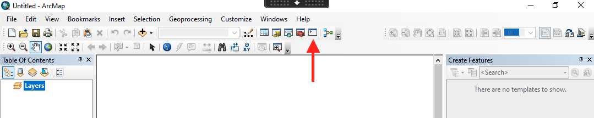

# Using Python within ESRI products

Python is heavily integrated into ESRI's products. It's so integrated that ArcMap
and ArcGIS Pro each ship with their own versions of Python. As a result, it can
sometimes be challenging to use ESRI-authored Python libraries alongside open-source libraries.

## ArcMap 10.X

When ArcMap is installed, it puts its own version of Python within `C:\Python27\ArcGIS10.8\python.exe`.

ArcMap uses Python 2.7, which has reached its end-of-life. The Python world at-large
has moved on from Python 2 and now uses Python 3. As a result, writing Python code
for ArcMap is only recommended if you need to programmatically manipulate the map design of a `.mxd` file. New geoprocessing scripts should use a more modern version of Python.

### Using an IDE

If you want to write code with this environment using your IDE, point the Python interpreter to previously mentioned path. You'll need to load the `arcpy` module with the following line at the top of your script:

```python
import arcpy

# ... the rest of your code goes here ...
```

### Using the ArcMap integration

You can also open a Python prompt directly within ArcMap by clicking the Python button. When you do this, `arcpy` is already imported, so there's no need to run `import arcpy`

Look for a small white square in the top ribbon with a "`>`" character inside:


After clicking the icon a new window will appear, allowing you to enter Python commands one at a time. You can also right-click within the Python window and select
"Load..." to load an entire Python script into the window.


## ArcGIS Pro

ArcGIS Pro uses Python 3, along with its own version of the `conda` environment manager. Although the module is still known as `arcpy`, many of the sub-modules and functions have new names, so Python code written for ArcMap might not work when run from Pro. When you're looking at the documentation, make sure it's for ArcGIS Pro and not ArcMap.
