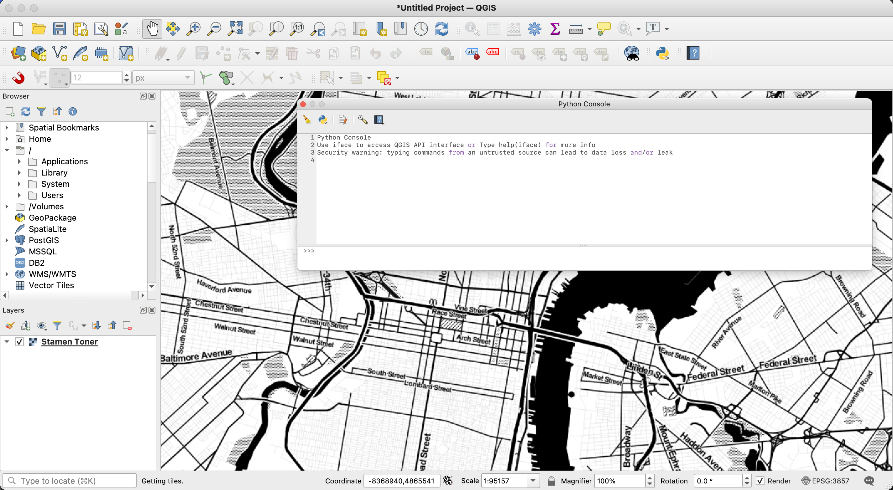

# Using Python within QGIS

QGIS is an open-source alternative to ESRI's ArcMap / ArcGIS Pro products. Like ESRI's
products, Python is directly integrated into the desktop interface, and code can
be run from standalone scripts as well as within the embedded Python window.

To open a Python window within QGIS, click "Plugins" on the top toolbar and then "Python Console"

